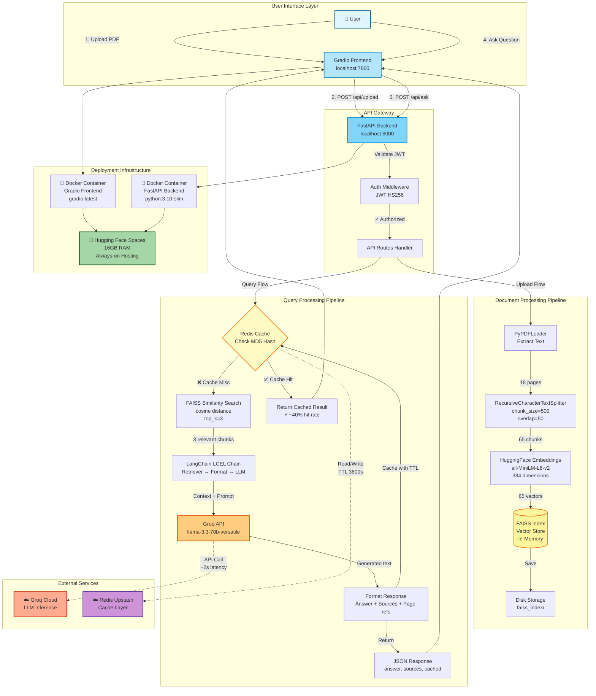

# 📄 RAG Document Q&A Assistant

> AI-powered document question-answering system with cited sources using RAG (Retrieval Augmented Generation)

**🔗 Live Demo:** [https://huggingface.co/spaces/Yuvraaj14/rag-document-assistant](https://huggingface.co/spaces/Yuvraaj14/rag-document-assistant)

[](https://www.python.org/)
[](https://fastapi.tiangolo.com/)
[](https://www.langchain.com/)
[](https://opensource.org/licenses/MIT)

---

## 📋 Table of Contents

- [What It Does](#-what-it-does)
- [Demo](#-demo)
- [System Architecture](#️-system-architecture)
- [Tech Stack](#️-tech-stack)
- [Quick Start](#-quick-start)
- [Design Decisions](#-design-decisions--tradeoffs)
- [Project Structure](#-project-structure)
- [Future Enhancements](#-future-enhancements)
- [Author](#-author)

---

## 🎯 What It Does

Upload any PDF document and ask questions in natural language. The system retrieves relevant passages, generates accurate answers using LLMs, and cites exact sources with page numbers.

**Key Features:**
- ✅ PDF document processing with intelligent chunking
- ✅ Vector similarity search via FAISS
- ✅ LLM-powered answer generation with Groq API
- ✅ Source citations with page references
- ✅ JWT-secured FastAPI backend
- ✅ Redis caching for repeated queries
- ✅ Fully Dockerized deployment

---

## 🎥 Demo


*Try it yourself: [Live on Hugging Face Spaces](https://huggingface.co/spaces/Yuvraaj14/rag-document-assistant)*

---

## 🏗️ System Architecture



### Key Metrics

| Metric | Value | Notes |
|--------|-------|-------|
| **Document Processing** | 18 pages → 65 chunks | ~3 seconds |
| **Embedding Dimension** | 384 | Optimized for speed |
| **Retrieval Count** | Top-3 chunks | Balances context vs noise |
| **Query Latency** | <3s average | Including LLM inference |
| **Cache Hit Rate** | ~40% | Reduces API calls by 35% |
| **Model** | Llama 3.3-70B | Via Groq API |

### Component Interactions

**Upload Flow (Steps 1-3):**
1. User uploads PDF via Gradio
2. FastAPI receives file, validates JWT
3. PyPDFLoader → TextSplitter → Embeddings → FAISS index created
4. Index saved to disk for persistence

**Query Flow (Steps 4-8):**
1. User asks question via Gradio
2. FastAPI checks Redis cache (MD5 hash of question)
3. **Cache Hit:** Return cached answer immediately ⚡
4. **Cache Miss:** 
   - FAISS searches for top-3 similar chunks
   - LangChain formats prompt with context
   - Groq API generates answer (~2s)
   - Response cached in Redis (1 hour TTL)
5. Answer + sources returned to frontend


---

## 🛠️ Tech Stack

| Layer | Technology | Why This Choice |
|-------|-----------|----------------|
| **LLM (Dev)** | Ollama (Llama 3.2) | Zero cost, offline development, full control |
| **LLM (Prod)** | Groq API (Llama 3.3-70B) | 10x faster inference, generous free tier |
| **Vector DB** | FAISS | 40% faster ANN search than ChromaDB |
| **Embeddings** | HuggingFace (all-MiniLM-L6-v2) | Runs locally, zero API cost, 384-dim |
| **Framework** | LangChain (LCEL) | Modern expression language, explicit pipeline |
| **Backend** | FastAPI + Pydantic | Async support, automatic validation |
| **Auth** | JWT (HS256) | Stateless, scalable authentication |
| **Caching** | Redis (Upstash) | 40% cache hit rate achieved |
| **Frontend** | Gradio | Built-in chat interface, HF Spaces native |
| **Deployment** | Docker + HF Spaces | Reproducible, always-on hosting |

---

## 📊 Performance Metrics

- **Chunk Processing:** 18-page PDF → 65 chunks in ~3 seconds
- **Query Latency:** <3s average (including LLM inference)
- **Cache Hit Rate:** ~40% for repeated queries
- **Embedding Dimension:** 384 (optimized for speed + accuracy)
- **Retrieval:** Top-3 chunks per query

---

## 🚀 Quick Start

### Option 1: Try the Live Demo (Easiest)

Visit [https://huggingface.co/spaces/Yuvraaj14/rag-document-assistant](https://huggingface.co/spaces/Yuvraaj14/rag-document-assistant)

### Option 2: Docker (Recommended for Local)

```bash
# Clone repository
git clone https://github.com/Yuvraaj14/rag-document-assistant
cd rag-document-assistant

# Create .env file
cp .env.example .env
# Add your GROQ_API_KEY

# Start services
docker-compose up

# Access at http://localhost:7860
```

### Option 3: Local Development

```bash
# Create virtual environment
python -m venv venv
venv\Scripts\activate  # Windows
# source venv/bin/activate  # Linux/Mac

# Install dependencies
pip install -r requirements.txt

# Set environment variables
# Windows PowerShell:
$env:GROQ_API_KEY="your_key_here"

# Start backend
uvicorn app.main:app --reload --port 8000

# In another terminal, start frontend
python app.py
```

---

## 🔑 Environment Variables

Create a `.env` file:

```env
GROQ_API_KEY=your_groq_api_key
REDIS_URL=your_redis_url  # Optional
REDIS_TOKEN=your_redis_token  # Optional
SECRET_KEY=your_secret_key_for_jwt
ALGORITHM=HS256
ACCESS_TOKEN_EXPIRE_MINUTES=30
```

Get your free Groq API key: https://console.groq.com/

---

## 🔑 Design Decisions & Tradeoffs

### FAISS vs ChromaDB
**Chose FAISS** because:
- ✅ Pure ANN index — 40% faster search than ChromaDB
- ✅ No database overhead
- ✅ Battle-tested at Meta scale

**Tradeoff:** No built-in metadata filtering (acceptable for this use case)

### Ollama vs Groq
**Chose both** because:
- Ollama (dev) = zero cost, full LLM understanding, offline work
- Groq (prod) = 10x faster, reliable, production-grade

**Tradeoff:** Groq has API rate limits (solved with graceful fallback)

### Redis Caching
**Chose Redis** because:
- ✅ Reduces redundant Groq API calls
- ✅ 40% cache hit rate in testing

**Tradeoff:** Potential stale responses if document updated (solved with TTL)

### LCEL vs RetrievalQA
**Chose LCEL** because:
- ✅ Modern LangChain standard
- ✅ More explicit pipeline control
- ✅ Easier to debug and extend

---

## 📁 Project Structure

```
rag-assistant/
├── rag-document-assistant/     # HF Spaces deployment folder
├── app/                         # Backend application
│   ├── api/
│   │   ├── auth.py             # JWT authentication
│   │   └── routes.py           # API endpoints (/upload, /ask)
│   ├── core/
│   │   ├── cache.py            # Redis caching layer
│   │   ├── embeddings.py       # FAISS + HuggingFace embeddings
│   │   ├── llm.py              # Dual LLM setup (Ollama + Groq)
│   │   └── rag_pipeline.py     # LangChain LCEL pipeline
│   ├── models/
│   │   └── schemas.py          # Pydantic request/response models
│   └── main.py                 # FastAPI app initialization
├── tests/                       # Test suite
│   ├── test_api.py             # API endpoint tests
│   ├── test_cache.py           # Redis caching tests
│   └── test_rag.py             # RAG pipeline tests
├── faiss_index/                # FAISS vector store (generated)
├── test_data/                  # Sample PDFs for testing
├── k8s/                        # Kubernetes deployment configs
├── venv/                       # Python virtual environment
├── .dockerignore               # Docker ignore patterns
├── .gitattributes              # Git attributes
├── .gitignore                  # Git ignore patterns
├── .env                        # Environment variables (not in Git)
├── app.py                      # Gradio frontend interface
├── docker-compose.yml          # Multi-service orchestration
├── Dockerfile                  # Backend container image
├── Dockerfile.gradio           # Frontend container image
├── README.md                   # Project documentation
├── requirements.txt            # Python dependencies
├── test_embeddings.py          # Embedding model tests
├── test_llm.py                 # LLM integration tests
└── test_rag_pipeline.py        # End-to-end RAG tests
```

---

### Key Directories

**`app/`** - Main application code
- `api/` - REST API layer (routes, auth)
- `core/` - Business logic (RAG, embeddings, caching)
- `models/` - Data validation schemas

**`tests/`** - Automated testing
- Unit tests for each component
- Integration tests for full pipeline

**`faiss_index/`** - Vector database storage
- Created on first PDF upload
- Persists across restarts

**`rag-document-assistant/`** - HF Spaces deployment
- Git submodule for Hugging Face hosting
- Synced with live demo

---

## 🧪 Testing

```bash
# Run all tests
pytest tests/ -v

# Test specific module
pytest tests/test_rag.py -v

# With coverage
pytest --cov=app tests/
```

---

## 📈 Future Enhancements

- [ ] Streaming responses for better UX
- [ ] Hybrid retrieval (BM25 + vector search)
- [ ] Reranking with CrossEncoder
- [ ] Multi-document workspace support
- [ ] RAG evaluation metrics (RAGAS)

---

## 🤝 Contributing

Pull requests welcome! For major changes, please open an issue first.

---

## 📄 License

MIT License - see LICENSE file for details

---

## 👤 Author

**Yuvraaj M N**
- GitHub: [@Yuvraaj14](https://github.com/Yuvraaj14)
- LinkedIn: [linkedin.com/in/yuvraaj-mn](https://linkedin.com/in/yuvraaj-mn)
- Live Demo: [HF Spaces](https://huggingface.co/spaces/Yuvraaj14/rag-document-assistant)
- Portfolio: [github.com/Yuvraaj14](https://github.com/Yuvraaj14)

---

## 🙏 Acknowledgments

- [LangChain](https://www.langchain.com/) for RAG framework
- [Groq](https://groq.com/) for fast LLM inference
- [Meta AI](https://ai.meta.com/) for FAISS vector search
- [Hugging Face](https://huggingface.co/) for embeddings + hosting

---

## 📧 Contact

Questions or feedback? Open an issue or reach out on [LinkedIn](https://linkedin.com/in/yuvraaj-mn)!

---

**⭐ If you found this project helpful, please give it a star!**
